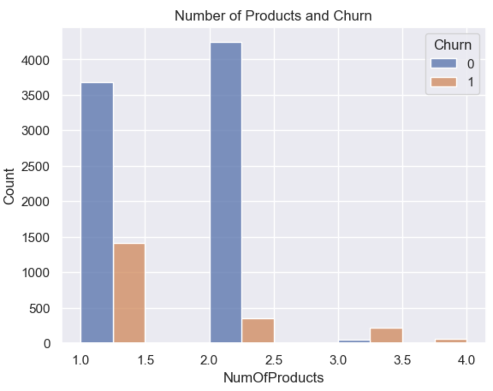

# Customer Churn Prediction

This project focuses on customer churn prediction using machine learning techniques, specifically Random Forest (RF) and Decision Tree (DT) models. The dataset used contains 10,000 customer entries with various features that may influence a customer's decision to leave the bank. The dataset used in this analysis is sourced from [Kaggle](https://www.kaggle.com/datasets/mathchi/churn-for-bank-customers?datasetId=797699&sortBy=voteCount). The dataset utilized is imbalanced, which often leads to good accuracy but low recall and F1 scores. Such outcomes indicate a significant number of false negatives, which can be detrimental in churn prediction as it results in overlooking potential customer losses. To mitigate this challenge, an efficiency comparison analysis is conducted by employing the SMOTE (Synthetic Minority Over-sampling Technique) to balance the training data. This project not only provides insights into customer retention strategies but also serves as a practical learning experience in applying machine learning methodologies to real-world problems.

## Table of Contents
- [Customer Churn Prediction](#customer-churn-prediction)
  - [Table of Contents](#table-of-contents)
  - [Dataset Overview](#dataset-overview)
    - [Dataset Structure](#dataset-structure)
    - [Statistical Description](#statistical-description)
  - [Data Preparation](#data-preparation)
  - [Exploratory Data Analysis](#exploratory-data-analysis)
    - [Summary of EDA findings](#summary-of-eda-findings)
  - [Encoding and Normalization](#encoding-and-normalization)
  - [Outliers](#outliers)
  - [Correlation Matrix](#correlation-matrix)
  - [Modeling](#modeling)
    - [Data Splitting](#data-splitting)
  - [Model Evaluation](#model-evaluation)
    - [Key Observations](#key-observations)
  - [SMOTE Analysis](#smote-analysis)
  - [How to use](#how-to-use)
    - [Prerequisites](#prerequisites)
    - [Installation](#installation)
  - [Conclusion](#conclusion)

## Dataset Overview
The dataset consists of 10 features that impact customer churn:

1. **CreditScore**: Higher scores correlate with lower churn rates.
2. **Geography**: Customer location can affect churn decisions.
3. **Gender**: The role of gender in customer churn.
4. **Age**: Older customers tend to be more loyal.
5. **Tenure**: Longer clients are generally less likely to churn.
6. **Balance**: Higher balances indicate a lower likelihood of leaving.
7. **NumOfProducts**: More products increase customer loyalty.
8. **HasCrCard**: Credit card holders are less likely to leave.
9. **IsActiveMember**: Active members show lower churn rates.
10. **EstimatedSalary**: Higher salaries correlate with lower churn rates.

The target variable is:
- **Churn**: Whether the customer left the bank (1 = Yes, 0 = No).

### Dataset Structure
- **Rows**: 10,000
- **Columns**: 14 (10 relevant features + 1 target variable)

### Statistical Description


## Data Preparation

1. **Dropping Unnecessary Columns**: The columns `RowNumber`, `CustomerId`, and `Surname` were removed as they do not contribute to the analysis.
   Top five rows of dataset with only relevant features looks like:


   
2. **Handling Missing Values**: Checked for missing values—none found.

3. **Handling Duplicates**: Checked for duplicates—none found.

4. **Renaming Columns**: The `Exited` column was renamed to `Churn`.


## Exploratory Data Analysis

The following graphs visualize the distribution of churn and other factors:

1. **Total Churning Distribution**: A pie chart showing the distribution of churned vs. non-churned customers.


2. **Gender Distribution**: A pie chart and histogram showinggender demographics and churn rates.
   


3. **Age Distribution**: Histograms showing churn rates across different age groups.


4. **Geography Distribution**: A histogram displaying churn distribution by customer location.


5. **CreditScore, Tenure, Balance, and Other Features**: Additional plots to visualize relationships between features and churn.




### Summary of EDA findings
The dataset is highly imbalanced, with around 80% of customers not churning and 20% churning. Gender-wise, a majority of customers are male, but more female customers are likely to churn. Age distribution shows that churn is more common among customers aged 40-50. Geographically, most customers are from France, but a higher churn rate is observed in Germany. Credit scores indicate that customers with intermediate scores have a higher tendency to churn, whereas those with very high or low scores are more stable. Tenure-wise, both long-term and new customers are less likely to churn, with the highest churn rates among customers with 1-9 years of tenure. Customers with zero balances show the highest churn rate, while those with higher balances are less likely to leave. Customers with 1-2 products are most common among both churners and non-churners. Additionally, the majority of churners are less active members, although a significant number of active customers also churn. Lastly, estimated salary does not show a clear pattern, as the churn rate remains similar across different salary ranges. These findings highlight key features that influence customer churn, providing important insights for building prediction models.

## Encoding and Normalization

- Categorical variables (`Geography`, `Gender`) were one-hot encoded.
- Numerical features were normalized using StandardScaler to facilitate model training.
- Statistics of encoded and normalized dataset looks like:
  


## Outliers
To investigate the presence of outliers, a box plot was created for all features in the dataset. The analysis revealed that the outliers identified do not appear to be noise that should be removed, as they seem reasonable within the context of the data.


## Correlation Matrix
To assess the independence of features, correlation matrix was plotted. The heatmap matrix indicated that there is no significant correlation observed among the features, suggesting that they are independent of each other.


## Modeling

### Data Splitting
Divide the dataset into training and testing sets (75%-25%).
Two models were utilized for predicting customer churn:
1. **Decision Tree**: Hyperparameter tuning was performed using GridSearchCV.

2. **Random Forest**: Similar hyperparameter tuning as Decision Tree.

- Accuracies scores for both the models are analyzed.

## Model Evaluation

1. **Confusion Matrix**: Displays true positives, false positives, true negatives, and false negatives for both models.


2. **Classification Report**: Includes metrics such as precision, recall, and F1-score.

### Key Observations
- In both the models, accuracies are similar but the lower recall (<0.5) and F1-score (<0.6) for class `1` indicates difficulty in predicting churners. This may be due to the imbalanced data. 

## SMOTE Analysis

To address data imbalance, SMOTE was applied to the training data, resulting in a balanced dataset. Using the SMOTE training dataset both the models are trained with hyperparameter tuning. After retraining models on the balanced dataset, improved metrics were observed.


## How to use

### Prerequisites
- Python 3.x
- Required libraries: `pandas`, `numpy`, `matplotlib`, `seaborn`, `scikit-learn`, `imblearn`

### Installation
1. Clone the repository to your local machine.
2. Install Dependencies:
   ```bash
   pip install pandas numpy matplotlib seaborn scikit-learn imblearn
   ```

## Conclusion
This project focused on predicting customer churn using machine learning techniques, specifically a Decision Tree and Random Forest models. Through exploratory data analysis (EDA), data preprocessing, and model training, we gained insights into the key factors influencing customer churn and how machine learning models can be applied for efficient predictions. The project also addressed the challenges posed by imbalanced data and evaluated the model's performance using various metrics. While the accuracy and results from the Random Forest model provide a good baseline, further tuning and experimentation with other algorithms could enhance performance.

This project is intended for learning purposes, providing a comprehensive workflow for churn prediction, from data analysis to model evaluation. It serves as a valuable hands-on experience for understanding the practical applications of machine learning in customer retention analysis.